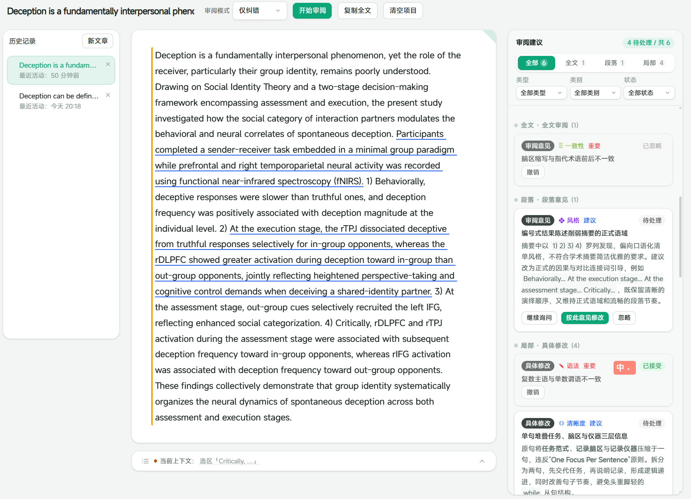
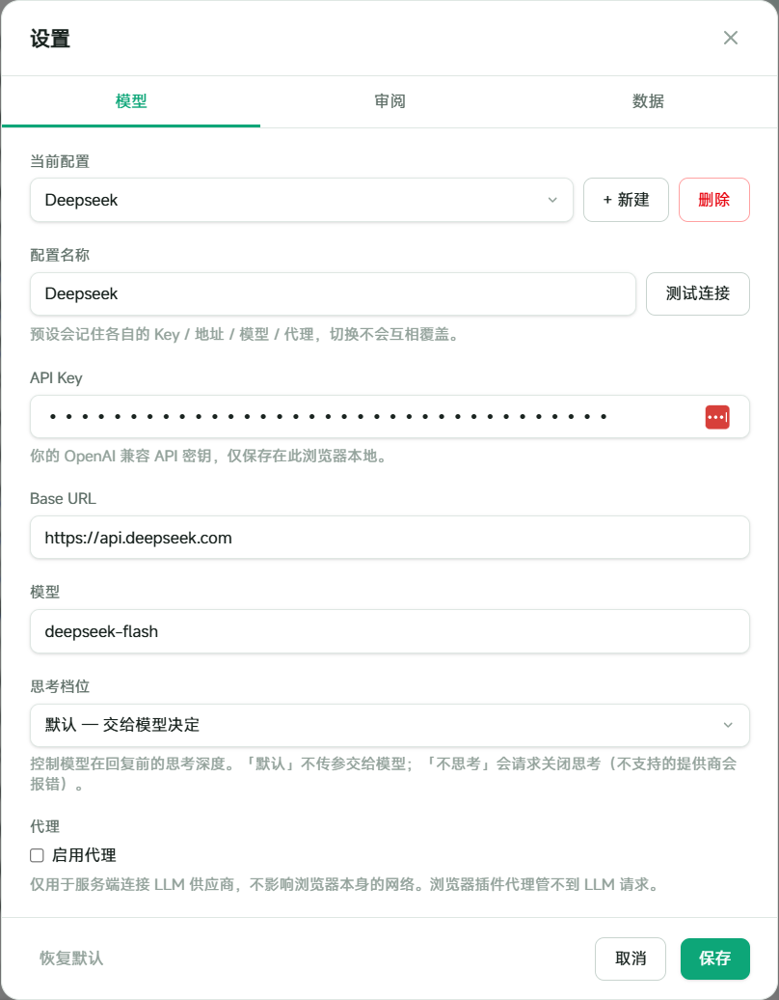
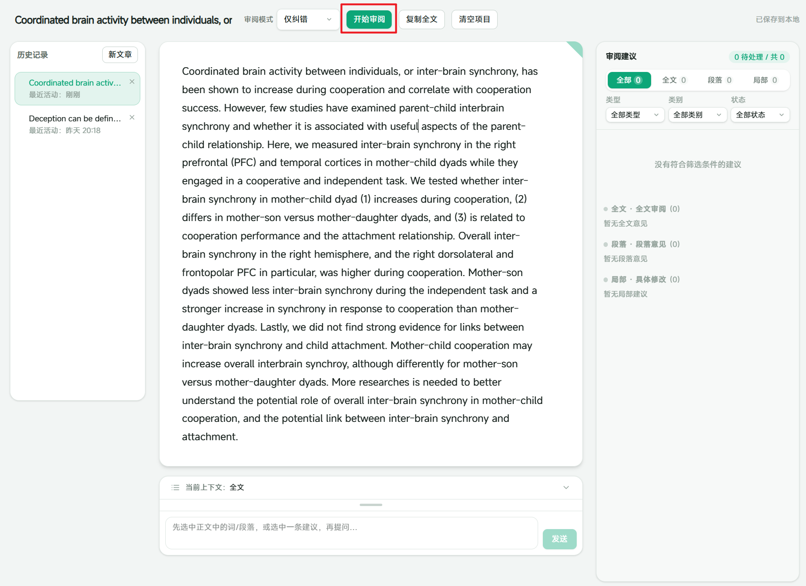
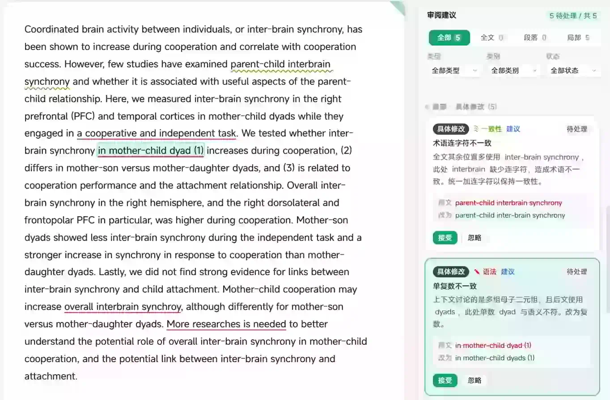
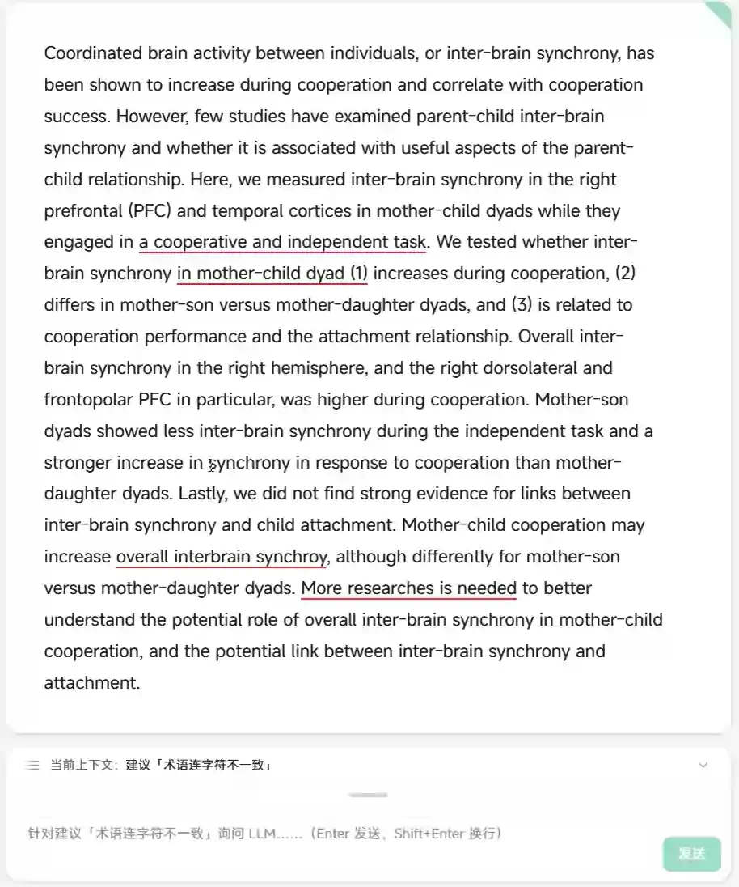
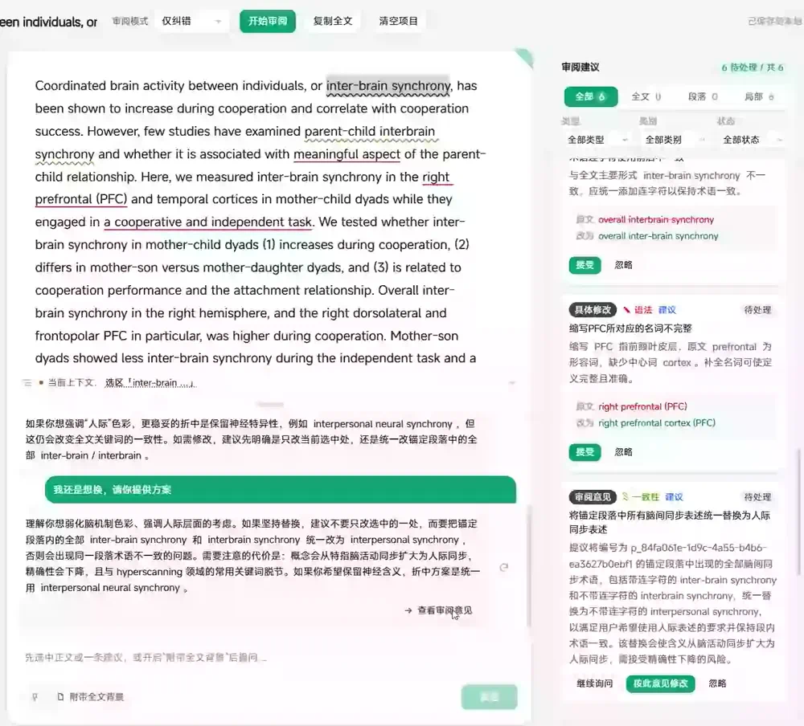

<p align="center">
  <a href="./README.md">English</a> · <strong>简体中文</strong>
</p>

# ScholarWeave

> 面向学术论文的本地优先写作工作台，将选区锚定、上下文 AI 对话和用户可控的正文修改编织在同一条工作流中。

ScholarWeave 是一个面向研究者的学术写作助手。它让每条反馈都与触发反馈的原文位置保持连接：审阅建议、正文选区和后续讨论都位于同一个工作区中。你可以从“哪里需要修改”自然地追问“为什么”，然后在确认后完成修改，而不会丢失上下文。适合希望LLM润色辅助，但同时希望对自己的论文有较强掌控力的用户。

## 为什么开发 ScholarWeave？

在修改论文时，你是否常常遇到下面的问题？

使用 Chatbot 修改文章，哪怕只是调整一个细节，也可能需要反复附上原文、背景和要求。对话越长，上下文越多，每一轮请求的成本也越高。而那些文字功底扎实、语感出色的模型，往往并不便宜。如果主动缩减上下文，又容易丢失必要的背景信息，只能不断手动复制、补充和解释，整个过程既繁琐，也容易打断写作思路。

Agent 类应用虽然能够减少复制粘贴，并直接对文章进行修改，但生成的文字有时不够精细，对局部措辞、语气和句式的控制也往往不够灵活。

因此，我希望有一种介于两者之间的工具：

- 像 Agent 一样理解文章结构并协助修改，减少重复的复制与粘贴；
- 像 Chatbot 一样允许用户精确控制上下文，避免不必要的消耗；
- 既能专注讨论一个词、一句话或一处具体修改，也能将其放在段落乃至全文的框架下进行考虑；
- 将交互式的模型建议纳入清晰的审阅流程，由用户决定接受、忽略、继续讨论或进一步修改。

ScholarWeave 正是这一思路的实践：一种基于大语言模型的、类 Grammarly 的学术写作工作流。

它的本质仍然是人与 LLM 的对话，但通过锚定选区、上下文管理和审阅机制，让每一次讨论都围绕明确的文本范围展开。模型负责提供语言建议，用户保留对正文和修改过程的最终控制，从而形成一种人工主导、LLM 辅助的写作方式，兼顾精确性、效率与使用成本。

项目的本质是希望通过UI设计和上下文管理，让修改英文论文变得不再繁琐，但同时用户可以保持对文本的掌控力。

我最初开发 ScholarWeave，是为了修改自己的学术论文。目前，它主要面向英文论文的语言润色与修改，用户语言固定为中文。有兴趣的用户可以自己mod一下。

目前C盘剩余空间爆炸中，暂时没有用Tauri打包的条件，就再说吧。

## 核心能力

ScholarWeave 以论文正文为工作中心：

- **锚定式反馈**：建议可以针对全文、自然段或精确文字选区。
- **上下文对话**：可以围绕当前选区、某条审阅建议、某个段落或全文向 LLM 提问。
- **可控修改**：任何修改都会先生成预览，再由用户确认，不会静默改写正文。
- **清晰的审阅流程**：支持接受、忽略、撤销，并能查看无法继续定位的过期建议。
- **本地优先存储**：草稿和聊天历史通过 IndexedDB 保存在当前浏览器中。
- **内置演示数据**：打开应用即可看到示例论文，无需先连接模型就能体验完整审阅流程。

<p align="center">
  
</p>

## 快速开始

要求：**Node.js 20.9 或更高版本**。

```bash
npm install
npm run dev
```

打开 [http://localhost:3000](http://localhost:3000)。

编辑器和内置演示数据无需 API Key 即可使用。如果要执行真实审阅或聊天，请根据模板创建本地环境文件：

```bash
# macOS / Linux
cp .env.example .env.local

# Windows PowerShell
Copy-Item .env.example .env.local
```

然后在 `.env.local` 中填写模型供应商配置，或者在应用的 **设置 → 模型** 中配置 OpenAI 兼容供应商。`.env.local` 已被 Git 忽略，绝不能提交或分享。

## 模型配置

ScholarWeave 使用 OpenAI 兼容的聊天协议，可以连接 OpenAI、DeepSeek、OpenRouter，以及其他提供兼容接口的模型服务。模型信息可以通过以下两种方式配置。

### 通过网页配置

打开 **设置 → 模型**，即可建立并切换多套模型预设。每套预设可以分别保存 API Key、Base URL、模型名称、思考档位和代理设置，适合在不同模型或供应商之间快速切换。

网页预设保存在当前浏览器的 `localStorage` 中，保存后立即生效，不会写入项目文件，也不会被 Git 提交。由于 API Key 会以明文形式保存在浏览器本地，这种方式只适合在可信的个人设备上使用。

<p align="center">
  
</p>

## 功能使用

### 选择审阅模式和开始审阅

首先选择审阅模式，分为“仅纠错”，“适度润色”和“深度审阅”。ScholarWeave 提供不同层级的审阅模式，用于控制 LLM 关注的范围与介入程度。你可以只检查明确的语言错误，也可以进一步审视表达是否清晰、结构是否连贯，以及整体文风是否符合学术写作要求。点击开始审阅后，系统会交由LLM进行审阅。

<p align="center">
  
</p>

### 审阅意见

返回的审阅意见分3类
- **全文**：关注文章的整体结构、论证顺序、写作风格和术语一致性。这类意见通常提供改进方向，不会直接改写正文。
- **段落**：关注单个段落的功能、内部组织及其与上下文的衔接，例如是否需要拆分、合并或调整论述顺序。
- **局部**：锚定到具体词语或句子，展示原文、建议改写及修改理由。确认无误后，可以直接接受修改。

大多的审阅意见可以直接在窗口选择“接受”或者“忽略”来进行处理，单击意见可以迅速定位意见涉及的具体段落或者语句。

<p align="center">
  
</p>

### 与LLM的交流

如果有需要交流的地方，可以手动选取与LLM进行交流，系统会将整段内容与选区内容共同发送给LLM。

<p align="center">
  
</p>

### 交流结果转化为审阅意见

与LLM之间的交流同样可以转化为审阅意见并一键执行。

<p align="center">
  
</p>

## 隐私

- 草稿和聊天历史保存在当前浏览器的 IndexedDB 中。
- 开始审阅或发送聊天消息时，相关正文上下文会发送给用户选择的模型供应商。
- 服务端凭据保存在环境变量中。设置面板中输入的 Key 会以本地浏览器存储的形式保存，仅适合个人本地使用。
- 本项目不提供托管服务、账户系统或遥测功能。

在确认模型供应商的数据保留政策和本地存储安全性之前，不建议将机密论文交给当前原型处理。

## 技术栈

- Next.js 16、React 19、TypeScript
- Tiptap 3 编辑器
- Zod 运行时协议校验
- Dexie / IndexedDB 本地持久化
- Tailwind CSS 界面样式
- Vitest 和 Playwright 自动化测试

## 项目状态

ScholarWeave 目前仍处于积极开发的原型阶段。审阅、锚定、聊天、持久化和本地打包主流程已经实现，但 API 和界面细节仍可能继续变化。

实现约定、架构说明、打包细节和排错方式见 [DEVELOPMENTER.md](./DEVELOPMENTER.md)。产品计划和里程碑记录见 [plan/CHANGELOG.md](./plan/CHANGELOG.md)。

## 参与贡献

欢迎提交 Issue、设计反馈和聚焦明确的 Pull Request。修改数据模型、锚定规则、LLM 协议或持久化层之前，请先阅读 [DEVELOPMENTER.md](./DEVELOPMENTER.md)。

## 许可证

本项目采用 [MIT License](./LICENSE) 发布。第三方依赖、字体和示例内容可能有各自的许可证，本项目不会替它们重新授权。
